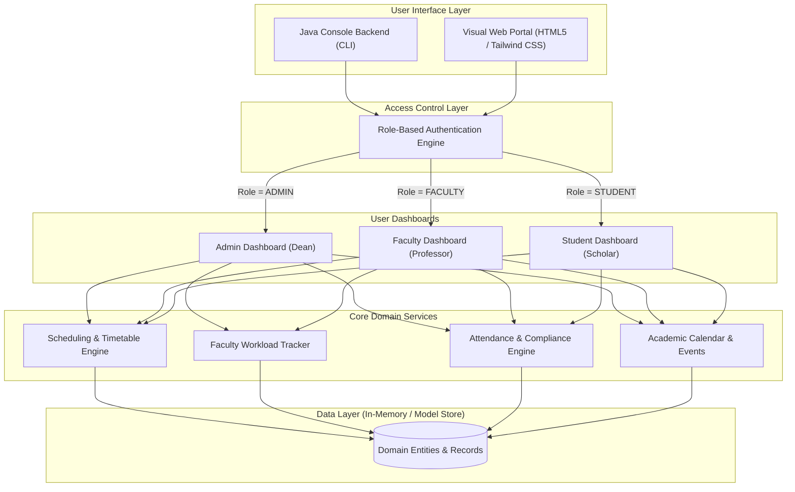

<div align="center">

# 🎓 EduTime — Academic Operations & Time Management System

[](https://www.oracle.com/java/)
[](#-role-based-access-control-rbac)
[](LICENSE)
[](#-getting-started)
[](CONTRIBUTING.md)

**A unified, role-based academic management platform designed for universities and higher-education institutions to organize class scheduling, track faculty workload hours, monitor student attendance, and coordinate campus academic events.**

[Explore Features](#-key-features) • [Quick Start](#-getting-started) • [RBAC Matrix](#-role-based-access-control-rbac) • [Roadmap](#-roadmap)

</div>

---

## 📋 Table of Contents

- [About the Project](#-about-the-project)
- [Key Features](#-key-features)
- [System Architecture](#-system-architecture)
- [Role-Based Access Control (RBAC)](#-role-based-access-control-rbac)
- [Demo Credentials](#-demo-credentials)
- [Getting Started](#-getting-started)
  - [Prerequisites](#prerequisites)
  - [Installation & Compilation](#installation--compilation)
  - [Running the Java Engine](#running-the-java-engine)
  - [Running the Visual Web Portal](#running-the-visual-web-portal)
- [Business Logic & Mathematical Formulations](#-business-logic--mathematical-formulations)
- [Project Structure](#-project-structure)
- [Roadmap](#-roadmap)
- [Contributing](#-contributing)
- [License](#-license)

---

## 📖 About the Project

In modern educational institutions, managing time effectively is critical for academic excellence. Scheduling clashes, unmonitored faculty workload hours, untracked student absenteeism, and disconnected event notices often lead to operational friction.

**EduTime** addresses these bottlenecks by providing:
- **Zero-Conflict Scheduling**: Coordinated timetable management mapped across venues and instructional staff.
- **Auditable Faculty Hours**: Detailed tracking of instructional hours, laboratory duties, research supervision, and administrative obligations.
- **Threshold-Driven Attendance Compliance**: Automated calculation of attendance percentages against mandatory institutional benchmarks (e.g., 75% minimum).
- **Synchronized Campus Calendar**: Broadcasts midterms, symposiums, and academic workshops to all campus stakeholders.

---

## ✨ Key Features

### 🏛️ 1. Master Class Timetable Management
- Full lifecycle control for class sessions: Course Code, Title, Faculty In-Charge, Day, Time Interval, and Classroom/Lab.
- Conflict prevention and day-of-week filtering (`Monday` through `Friday`).
- Department-wide timetable visibility.

### ⏱️ 2. Faculty Workload & Hour Auditing
- Multi-category workload logging:
  - *Lecture Delivery*
  - *Lab Supervision*
  - *Curriculum & Exam Grading*
  - *Research & Departmental Meetings*
- Real-time weekly progress meter against workload benchmarks (target: 20.0 hours/week).
- Administrative oversight reports for dean and department heads.

### 📊 3. Student Attendance Registry & Compliance
- Session-based attendance logging (`Present` / `Absent`) per student and course.
- Real-time automated percentage calculation.
- Dynamic compliance warnings:
  - 🟢 **Good Standing**: $\ge 75\%$
  - 🟡 **Warning / Needs Improvement**: $< 75\%$ (alerts student to risk of exam disqualification).

### 📅 4. Centralized Academic Activities & Events
- Campus-wide scheduling for symposiums, midterm examinations, guest lectures, and faculty senate meetings.
- Includes venue allocation, time slots, and organizing departments.

---

## 🏛️ System Architecture



---

## 🔐 Role-Based Access Control (RBAC)

| Capability / Module | Administrator | Faculty | Student |
| :--- | :---: | :---: | :---: |
| **Create / Modify Class Schedules** | ✅ | ❌ | ❌ |
| **View Master Timetable** | ✅ | ❌ | ❌ |
| **View Assigned Teaching Timetable** | ✅ | ✅ | ❌ |
| **View Personal Student Timetable** | ❌ | ❌ | ✅ |
| **Log Faculty Working Hours** | ❌ | ✅ | ❌ |
| **Audit All Faculty Hours** | ✅ | ❌ | ❌ |
| **Mark Student Attendance** | ❌ | ✅ | ❌ |
| **Review Course Attendance** | ✅ | ✅ | ❌ |
| **Track Personal Attendance & %** | ❌ | ❌ | ✅ |
| **Schedule Academic Activities** | ✅ | ❌ | ❌ |
| **View Academic Calendar / Events** | ✅ | ✅ | ✅ |

---

## 🔑 Demo Credentials

The system includes pre-loaded demonstration accounts:

| Role | Username | Password | Full Name & Title |
| :--- | :--- | :--- | :--- |
| **Admin** | `admin` | `admin123` | Dr. Robert Vance *(Dean of Academic Affairs)* |
| **Faculty** | `prof_smith` | `fac123` | Prof. Alice Smith *(Computer Science Dept)* |
| **Faculty** | `prof_john` | `fac123` | Prof. John Miller *(Information Technology Dept)* |
| **Student** | `stu_emma` | `stu123` | Emma Watson *(B.Tech Computer Science)* |
| **Student** | `stu_david` | `stu123` | David Clark *(B.Tech Computer Science)* |

---

## 🚀 Getting Started

### Prerequisites

- **Java Development Kit (JDK 17 or higher)**  
  Verify installation:
  ```bash
  java -version
  javac -version
  ```
- **Modern Web Browser** (Chrome, Edge, Firefox, or Safari)

### Installation & Compilation

1. Clone or download the repository:
   ```bash
   git clone https://github.com/your-username/edutime-institution-management.git
   cd edutime-institution-management
   ```

2. Compile the core Java backend:
   ```bash
   javac TimeManagementSystem.java
   ```

### Running the Java Engine

Execute the compiled application:
```bash
java TimeManagementSystem
```
Follow the interactive CLI menu prompts to log in using any of the [demo credentials](#-demo-credentials).

### Running the Visual Web Portal

1. Locate `index.html` in the root project folder.
2. Open it directly in your browser:
   - **Windows**: Double-click `index.html` or run:
     ```powershell
     Start-Process index.html
     ```
   - **macOS**:
     ```bash
     open index.html
     ```
   - **Linux**:
     ```bash
     xdg-open index.html
     ```
3. Use the one-click **Switch View** pill in the top header bar to toggle seamlessly between **Admin**, **Faculty**, and **Student** portals.

---

## 📐 Business Logic & Mathematical Formulations

### 1. Student Attendance Percentage
The cumulative attendance metric for each student across sessions is computed as:

$$\text{Attendance Rate } (\%) = \left( \frac{\sum_{i=1}^{N} \mathbb{I}(\text{session}_i = \text{PRESENT})}{N} \right) \times 100$$

Where:
- $N$ is the total recorded instructional sessions for the student.
- $\mathbb{I}$ is the indicator function ($1$ if Present, $0$ if Absent).
- **Institutional Rule**: If $\text{Attendance Rate} < 75.0\%$, the student status is flagged as **Needs Improvement** with a mandatory exam clearance warning.

### 2. Faculty Academic Workload Computation
The accumulated workload for any faculty member over a specified evaluation cycle is:

$$\text{Workload}_{\text{total}} = \sum_{k=1}^{M} \text{Hours}_k$$

Where $\text{Hours}_k$ denotes the validated time logged for task category $k$ (e.g., lecture, laboratory supervision, research, or evaluation).

---

## 📁 Project Structure

```text
edutime-institution-management/
├── TimeManagementSystem.java   # Core Java implementation (100% line-by-line documented)
├── index.html                  # Responsive visual web portal (Tailwind CSS, Vanilla JS)
├── README.md                   # Professional project documentation (GitHub standard)
└── LICENSE                     # MIT License
```

---

## 🗺️ Roadmap

- [x] Role-Based Access Control (Admin, Faculty, Student)
- [x] Conflict-free Master Class Timetable engine
- [x] Faculty Workload logging & weekly progress tracking
- [x] Student Attendance calculator with $\ge 75\%$ compliance warnings
- [x] Interactive responsive web dashboard
- [ ] Relational Database integration (PostgreSQL / Spring Data JPA)
- [ ] REST API endpoints with JWT-based Bearer token authentication
- [ ] QR code and biometric check-in integration for automated student attendance
- [ ] Automated SMS / Email alerts for attendance defaulters

---

## 🤝 Contributing

Contributions are what make the open-source community an amazing place to learn, inspire, and create. Any contributions you make are **greatly appreciated**.

1. Fork the Project
2. Create your Feature Branch (`git checkout -b feature/AmazingFeature`)
3. Commit your Changes (`git commit -m 'Add some AmazingFeature'`)
4. Push to the Branch (`git push origin feature/AmazingFeature`)
5. Open a Pull Request

---

## 📄 License

Distributed under the **MIT License**. See `LICENSE` for more information.

---

<div align="center">
  <sub>Built with ❤️ for educational institutions and universities worldwide.</sub>
</div>
