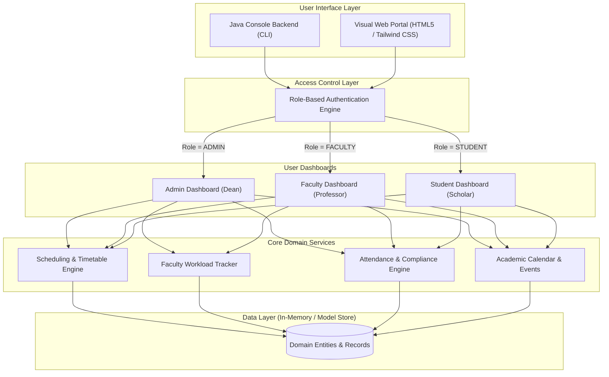

# 🎓 EduTime — Academic Operations & Time Management System

[](https://www.oracle.com/java/)
[](#-role-based-access-control-rbac)
[](LICENSE)
[](#-getting-started)
[](#-contributing)

> An integrated academic operations platform designed for universities and colleges to organize class scheduling, track faculty workload hours, monitor student attendance, and coordinate campus events.

[Explore Features](#-key-features) • [Quick Start](#-getting-started) • [RBAC Matrix](#-role-based-access-control-rbac) • [Roadmap](#-roadmap)

---

## 📋 Table of Contents

- [About the Project](#-about-the-project)
- [Key Features](#-key-features)
- [System Architecture](#-system-architecture)
- [Role-Based Access Control (RBAC)](#-role-based-access-control-rbac)
- [Demo Credentials](#-demo-credentials)
- [Getting Started](#-getting-started)
  - [Prerequisites](#prerequisites)
  - [Installation & Compilation](#installation--compilation)
  - [Running the Java Engine](#running-the-java-engine)
  - [Running the Visual Web Portal](#running-the-visual-web-portal)
- [Business Logic & Formulas](#-business-logic--formulas)
- [Project Structure](#-project-structure)
- [Roadmap](#-roadmap)
- [Contributing](#-contributing)
- [License](#-license)

---

## 📖 About the Project

In higher education institutions, coordinating academic schedules, monitoring faculty workload, and tracking student attendance often leads to administrative friction.

**EduTime** centralizes these workflows:
- **Zero-Conflict Scheduling**: Coordinated timetable management mapped across venues, departments, and instructional staff.
- **Auditable Faculty Hours**: Structured tracking of lecture delivery, laboratory supervision, research, and grading against institutional benchmarks.
- **Threshold-Driven Attendance Compliance**: Automated calculation of attendance percentages against mandatory requirements (75% minimum).
- **Synchronized Campus Calendar**: Broadcasts midterms, symposiums, and departmental meetings across all campus stakeholders.

---

## ✨ Key Features

### 🏛️ 1. Master Class Timetable Management
- Full lifecycle control for class sessions: Course Code, Title, Faculty In-Charge, Day, Time Interval, and Classroom/Lab.
- Conflict prevention and day-of-week filtering (`Monday` through `Friday`).
- Department-wide timetable visibility.

### ⏱️ 2. Faculty Workload & Hour Auditing
- Multi-category workload logging:
  - *Lecture Delivery*
  - *Lab Practical Supervision*
  - *Curriculum & Exam Grading*
  - *Research & Departmental Meetings*
- Real-time weekly progress meter against workload benchmarks (target: 20.0 hours/week).
- Administrative oversight reports for dean and department heads.

### 📊 3. Student Attendance Registry & Compliance
- Session-based attendance logging (`Present` / `Absent`) per student and course.
- Real-time automated percentage calculation.
- Dynamic compliance warnings:
  - 🟢 **Good Standing**: $\ge 75\%$
  - 🟡 **Warning / Needs Improvement**: $< 75\%$ (alerts student to risk of exam disqualification).

### 📅 4. Centralized Academic Activities & Events
- Campus-wide scheduling for symposiums, midterm examinations, guest lectures, and faculty meetings.
- Includes venue allocation, time slots, and organizing departments.

---

## 🏛️ System Architecture



---

## 🔐 Role-Based Access Control (RBAC)

| Capability / Module | Administrator | Faculty | Student |
| :--- | :---: | :---: | :---: |
| **Create / Modify Class Schedules** | ✅ | ❌ | ❌ |
| **View Master Timetable** | ✅ | ❌ | ❌ |
| **View Assigned Teaching Timetable** | ✅ | ✅ | ❌ |
| **View Personal Student Timetable** | ❌ | ❌ | ✅ |
| **Log Faculty Working Hours** | ❌ | ✅ | ❌ |
| **Audit All Faculty Hours** | ✅ | ❌ | ❌ |
| **Mark Student Attendance** | ❌ | ✅ | ❌ |
| **Review Course Attendance** | ✅ | ✅ | ❌ |
| **Track Personal Attendance & %** | ❌ | ❌ | ✅ |
| **Schedule Academic Activities** | ✅ | ❌ | ❌ |
| **View Academic Calendar / Events** | ✅ | ✅ | ✅ |

---

## 🔑 Demo Credentials

| Role | Username | Password | Full Name & Title |
| :--- | :--- | :--- | :--- |
| **Admin** | `admin` | `admin123` | Dr. Robert Vance *(Dean of Academic Affairs)* |
| **Faculty** | `prof_smith` | `fac123` | Prof. Alice Smith *(Computer Science Dept)* |
| **Faculty** | `prof_john` | `fac123` | Prof. John Miller *(Information Technology Dept)* |
| **Student** | `stu_emma` | `stu123` | Emma Watson *(B.Tech Computer Science)* |
| **Student** | `stu_david` | `stu123` | David Clark *(B.Tech Computer Science)* |

---

## 🚀 Getting Started

### Prerequisites

- **Java Development Kit (JDK 17 or higher)**
- **Modern Web Browser** (Chrome, Edge, Firefox, Safari)

### Installation & Compilation

1. Clone repository:
   ```bash
   git clone https://github.com/your-username/edutime-institution-management.git
   cd edutime-institution-management
   ```

2. Compile the Java application:
   ```bash
   javac TimeManagementSystem.java
   ```

### Running the Java Engine

```bash
java TimeManagementSystem
```

### Running the Visual Web Portal

Open `index.html` directly in your browser:
```bash
# Windows
start index.html

# macOS
open index.html

# Linux
xdg-open index.html
```

---

## 📐 Business Logic & Formulas

### 1. Student Attendance Percentage

$$\text{Attendance Rate } (\%) = \left( \frac{\sum_{i=1}^{N} \mathbb{I}(\text{session}_i = \text{PRESENT})}{N} \right) \times 100$$

* If $\text{Attendance Rate} < 75.0\%$, the student status is flagged with a mandatory exam clearance warning.

### 2. Faculty Academic Workload Computation

$$\text{Workload}_{\text{total}} = \sum_{k=1}^{M} \text{Hours}_k$$

* Minimum standard: **20.0 hours/week** across teaching, labs, grading, and departmental obligations.

---

## 📁 Project Structure

```text
edutime-institution-management/
├── .gitignore                  # Git exclusions for compiled Java bytecode
